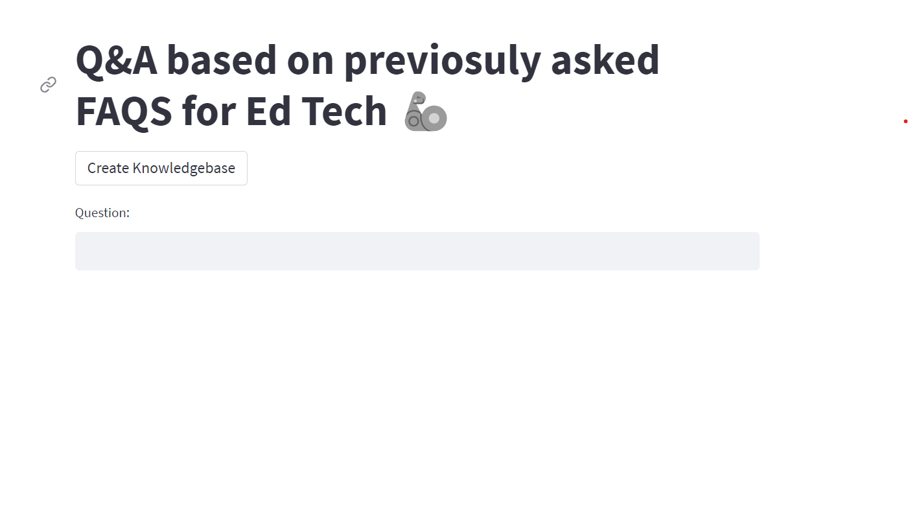

# Edtech Q&A: Question and Answer System Based on Google Palm LLM and Langchain for E-learning company  

This is an end to end LLM project based on Google Palm and Langchain.

## Using,
  - Langchain + Google Palm: LLM based Q&A
  - Streamlit: UI
  - Huggingface instructor embeddings: Text embeddings
  - FAISS: Vector databse
  - Faq.txt file sourced from the internet

## Project Structure

- main.py: The main Streamlit application script.
- langchain_helper.py: This has all the langchain code
- requirements.txt: A list of required Python packages for the project.
- .env: Configuration file for storing your Google API key.
